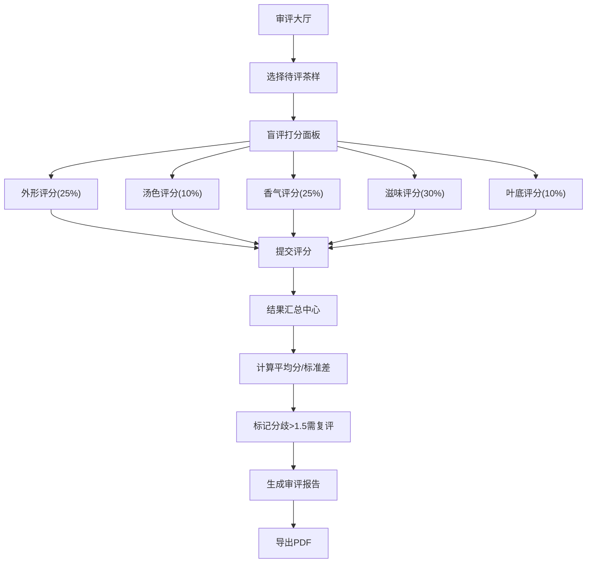

## 1. 产品概述

茶叶感官审评数字化面板是一款面向专业评茶师的盲评工具，用于标准化茶叶品质评估流程。系统通过随机编号隐藏茶样名称，确保评审客观性；支持按五项因子逐项打分，自动汇总多名评茶师的评分，标记分歧较大的茶样需复评，并生成可导出PDF的审评报告。

- 解决传统审评流程主观性强、数据零散、汇总耗时的问题
- 目标用户：茶叶质检机构、茶企品控部门、茶叶审评师

## 2. 核心特性

### 2.1 功能模块

1. **审评大厅（首页）**：展示待评茶样列表、评茶师信息、审评进度
2. **盲评打分面板**：五项因子逐项评分界面，含描述词下拉与滑块打分
3. **结果汇总中心**：多评茶师评分汇总、平均分/标准差计算、分歧标记
4. **审评报告页**：自动生成结构化报告、预览与PDF导出

### 2.2 页面详情

| 页面名称 | 模块名称 | 功能描述 |
|-----------|-------------|---------------------|
| 审评大厅 | 茶样列表卡片 | 随机编号显示、状态标签（待评/评审中/已完成）、进入评分入口 |
| 审评大厅 | 评茶师信息栏 | 当前评茶师身份、已评数量、审评轮次切换 |
| 盲评打分面板 | 五项因子评分卡 | 外形/汤色/香气/滋味/叶底，各含子项描述词下拉与0-10滑块 |
| 盲评打分面板 | 权重说明区 | 展示各因子权重占比、实时计算加权总分 |
| 盲评打分面板 | 提交与暂存 | 支持暂存草稿、提交评分、茶样切换导航 |
| 结果汇总中心 | 茶样汇总表格 | 每个茶样的平均分、各因子分项得分、标准差、复评标记 |
| 结果汇总中心 | 分歧分布图 | 标准差可视化条形图，高亮>1.5的需复评茶样 |
| 审评报告页 | 报告预览区 | 结构化展示审评结论、排名、综合评语 |
| 审评报告页 | 导出操作栏 | 一键导出PDF、复制报告摘要 |

## 3. 核心流程

评茶师登录系统 → 进入审评大厅查看待评茶样 → 点击茶样进入盲评面板 → 按五项因子逐项选择描述词并滑块打分 → 提交评分 → 系统汇总所有评茶师数据 → 计算平均分与标准差 → 标记分歧较大茶样 → 生成审评报告 → 导出PDF

## 4. 用户界面设计

### 4.1 设计风格

- **主色调**：深茶绿 `#2d5a27` 为主色，搭配金黄 `#c9a227` 点缀色，米色 `#f5f0e6` 为背景，传达专业茶文化氛围
- **辅助色**：暖橙 `#e67e22` 标识需复评项目，翡翠绿 `#27ae60` 标识优秀评分
- **字体**：标题采用「思源宋体」体现传统文化气质，正文采用「思源黑体」保证可读性
- **卡片风格**：微圆角(8px)、柔和阴影、茶褐色细描边，营造纸质审评表的质感
- **滑块样式**：自定义渐变滑块，左冷右暖色阶直观反映评分高低

### 4.2 页面设计概述

| 页面名称 | 模块名称 | UI 元素 |
|-----------|-------------|----------|
| 审评大厅 | 茶样卡片网格 | 3列布局、随机编号标签、状态chip、进度条装饰、hover上浮动效 |
| 盲评打分面板 | 五栏评分区 | 手风琴折叠卡、每项独立权重标签、描述词下拉徽章、渐变滑块轨道 |
| 盲评打分面板 | 总分悬浮条 | 页面底部固定、实时加权总分数字翻牌动效、提交按钮脉冲提示 |
| 结果汇总中心 | 数据表格 | 斑马纹行、标准差列条件着色、复评行高亮、数据条形内联图 |
| 审评报告页 | 报告正文 | A4尺寸模拟、分页分隔线、水印底纹、打印优化样式 |

### 4.3 响应式

桌面端优先（1280px+），平板端(768px)五栏折叠为两列，移动端(<640px)单列滚动布局，表格支持横向滚动。触摸设备优化滑块拖拽与下拉选择区域。

### 4.4 动效与交互

- 页面切换采用淡入+轻微位移过渡(300ms ease)
- 滑块拖拽时实时显示分数气泡
- 提交成功时展示茶叶飘落SVG动画
- 复评标记行有轻微呼吸灯效果吸引注意
