## 1. 架构设计

```mermaid
graph TD
    A["React 18 + TypeScript 前端层"] --> B["Zustand 状态管理层"]
    B --> C["审评业务 Store"]
    B --> D["报告生成 Store"]
    A --> E["页面层 (Pages)"]
    E --> E1["审评大厅 HallPage"]
    E --> E2["盲评打分面板 ReviewPanelPage"]
    E --> E3["结果汇总中心 SummaryPage"]
    E --> E4["审评报告页 ReportPage"]
    A --> F["组件层 (Components)"]
    F --> F1["茶样卡片 TeaSampleCard"]
    F --> F2["因子评分卡 FactorScoringCard"]
    F --> F3["自定义滑块 ScoreSlider"]
    F --> F4["描述词下拉 DescriptorSelect"]
    F --> F5["汇总数据表格 SummaryTable"]
    F --> F6["分歧柱状图 DeviationChart"]
    F --> F7["报告预览 ReportPreview"]
    A --> G["工具层 (Utils)"]
    G --> G1["统计计算 statistics.ts"]
    G --> G2["PDF导出 exportPdf.ts"]
    G --> G3["随机编号 randomize.ts"]
    G --> G4["模拟数据 mockData.ts"]
```



## 2. 技术描述

- **前端框架**：React@18 + TypeScript@5 + Vite@5
- **样式方案**：TailwindCSS@3（自定义茶主题色板）
- **状态管理**：Zustand@4（轻量级、不可变更新）
- **路由**：React Router DOM@6
- **图标**：Lucide React（茶叶/文档/图表类图标）
- **PDF导出**：html2canvas + jspdf（前端纯JS生成PDF）
- **图表**：纯CSS/SVG自实现简单条形图，避免引入重型图表库
- **后端**：无，全部前端 Mock 数据模拟

## 3. 路由定义

| 路由 | 页面 | 用途 |
|-------|------|------|
| `/` | 审评大厅 | 展示待评茶样列表、评茶师信息、快速导航 |
| `/review/:sampleId` | 盲评打分面板 | 五项因子逐项评分主界面 |
| `/summary` | 结果汇总中心 | 多评茶师评分汇总、标准差计算、复评标记 |
| `/report` | 审评报告页 | 报告预览、PDF导出操作 |

## 4. 数据模型

### 4.1 核心类型定义

```typescript
// 茶样
interface TeaSample {
  id: string;
  blindCode: string;        // 随机盲评编号，如 "A-047"
  realName?: string;        // 真实茶名，报告导出时可选择显示
  origin?: string;          // 产地
  category?: string;        // 茶类（绿茶/红茶/乌龙等）
}

// 评茶师
interface TeaJudge {
  id: string;
  name: string;
  title: string;            // 职称，如"高级评茶师"
  avatarColor: string;      // 头像背景色
}

// 因子子项
interface SubFactor {
  key: string;
  label: string;            // 如"条索"、"色泽"
  descriptors: string[];    // 可选描述词列表
  score: number;            // 0-10
  selectedDescriptor?: string;
}

// 五大因子
interface FactorScore {
  factorKey: 'appearance' | 'liquor' | 'aroma' | 'taste' | 'leaf';
  factorName: string;
  weight: number;           // 权重小数，如 0.25
  subFactors: SubFactor[];
  weightedScore: number;    // 计算后的加权分
}

// 单份评分（某评茶师对某茶样的完整评分）
interface JudgeScoreRecord {
  id: string;
  sampleId: string;
  judgeId: string;
  factors: FactorScore[];
  totalScore: number;       // 加权总分 0-100
  submittedAt: Date;
}

// 茶样汇总结果
interface SampleSummary {
  sampleId: string;
  blindCode: string;
  scoresCount: number;      // 参与评茶师数量
  meanScore: number;        // 平均分
  stdDeviation: number;     // 标准差
  factorMeans: Record<string, number>; // 各因子平均分
  factorStdDevs: Record<string, number>; // 各因子标准差
  needsReReview: boolean;   // 标准差>1.5 标记需复评
  rankings: number;         // 排名
}

// 审评报告
interface ReviewReport {
  id: string;
  generatedAt: Date;
  batchName: string;        // 审评批次名称
  judgeIds: string[];
  sampleSummaries: SampleSummary[];
  overallComments: string;  // 综合评语
}
```

### 4.2 因子与描述词常量

```
外形(25%)：条索[细紧/肥壮/重实/卷曲/挺直] 色泽[翠绿/乌润/金黄/灰绿/枯暗] 整碎[匀整/尚匀整/欠匀整/破碎] 净度[纯净/尚净/含梗/多杂]
汤色(10%)：色度[嫩绿/浅黄/橙红/深红/暗褐] 亮度[明亮/尚明/较暗/浑浊] 清澈度[清澈/尚清/微浑/沉淀]
香气(25%)：类型[毫香/嫩香/栗香/花香/果香/陈香] 纯度[纯正/尚纯/有杂/异气] 持久度[持久/尚持久/短/淡薄]
滋味(30%)：醇厚度[醇厚/醇和/平淡/粗淡] 回甘[明显/尚显/微有/无] 苦涩度[无/微涩/苦涩/重苦]
叶底(10%)：嫩度[细嫩/柔嫩/尚嫩/粗老] 匀度[匀齐/尚匀/欠匀/花杂] 色泽[嫩绿/红亮/黄绿/焦黑]
```

### 4.3 统计计算逻辑

```
平均分 = Σ单份总分 / 评分份数
标准差 = √( Σ(单份总分 - 平均分)² / 评分份数 )
加权总分 = 外形均分×25 + 汤色均分×10 + 香气均分×25 + 滋味均分×30 + 叶底均分×10
  （注：各因子均分由子项得分取平均后除以10换算百分制）
分歧判定：任一因子或总分标准差 > 1.5 → 标记需复评
```

## 5. Mock 数据设计

- 6个茶样，随机盲评编号 A-001 ~ A-006
- 5名评茶师（张工/李工/王工/赵工/陈工），每人对6茶样各一份评分
- 评分分布：人为制造1-2个茶样标准差>1.5，用于演示分歧标记
- 综合评语由模板+各因子平均等级自动拼接生成
